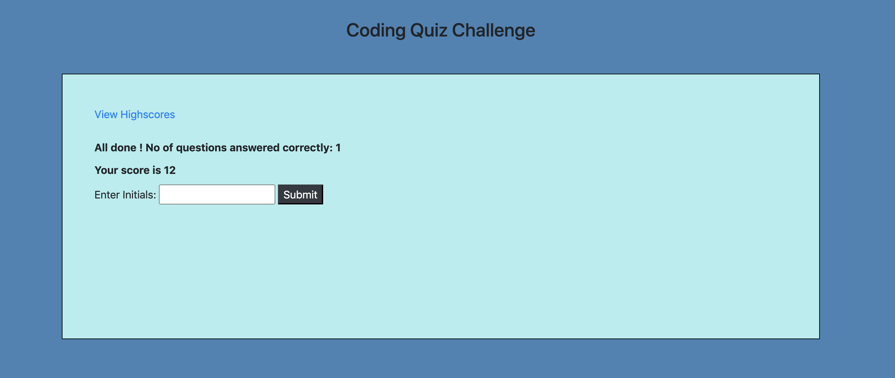

# Code-Quiz

## Website URL: https://sushmakaluva.github.io/Code-Quiz/

### Description

* The Code-Quiz is a quiz game that tests the user's knowledge on Javascript.

### How does it work?
 
* The user on clicking 'Start Quiz' displays questions one by one.
* Total time for this quiz is 75 sec, which is displayed on the timer.
* Each question is given 15 sec and if it is answered before that time, it goes to the next question.
* The scores are calculated as below:
    * score = (correctAnswerCount * 10) + Math.round(quizTimeLeft / 5);
* When time runs out and/or all questions are answered, the user is presented with their final score and asked to enter their initials.
* Also there is an option to "View Highscores"

### Technologies used to build this site:

* HTML5  
* CSS
* Bootstrap
* Javascript
* Jquery
* JSON

### Components used to build this quiz:

+ Bootstrap components - contaniers,buttons
+ Bootstrap grids - rows and columns 
+ Javascript functions
+ Local Storage variables
+ Timer functions - setInterval , setTimeout
+ Strings, Arrays, Loops, Objects
+ Sorting

